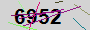
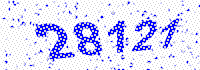
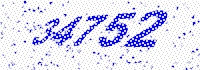
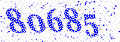
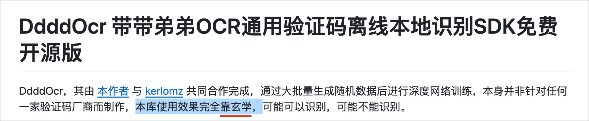

<div align="left">
    
    <br><br>
    當技職龍頭的表現與社會對他的期望有出入時，就會變成技職水龍頭。
    <h6>標準字製作: 王正宏</h6>
</div>

# NTUST-CaptchaCode-Bot-Tools

[書面報告, Hackmd（機器學習與大數據分析技術, 2026.6, MI5125701, 邱建樺 授課）](https://hackmd.io/@chenghungwang/ByNNEQ_lGx)<br>
[簡報, Figma (資訊安全導論課程期中報告, 2023.4, CS4003701, 王紹睿 授課)](https://www.figma.com/proto/JeyWwdnMcTaqSeOMaIMMXR/%E5%8F%B0%E7%A7%91%E5%A4%A7-%E8%B3%87%E8%A8%8A%E5%AE%89%E5%85%A8%E5%B0%8E%E8%AB%96-%E6%9C%9F%E4%B8%AD%E5%A0%B1%E5%91%8A?node-id=2-2079&viewport=828%2C508%2C0.19&t=tlZl0ebZaAKRU8i7-1&scaling=contain&content-scaling=fixed&starting-point-node-id=2%3A2079&page-id=0%3A1)

## 簡介

本專案目標在強調、驗證: 傳統的驗證碼防不住機器人，反而無端增添人類的麻煩。
<br>說的就是這些:<br>

  

  

  
<br>
這樣的主題，我曾經於「資訊安全導論」(2023.4)、「機器學習與大數據分析技術」(2026.6) 發表過。<br>
手法上，都是使用带带弟弟OCR相關的工具作為辨識與模型訓練的工具，光是带带弟弟OCR內建開箱即用的模型就能辨識出7成的驗證碼。<br>
若是自己 Train 模型，實測抓取 1000 的正確率都可以高達 97% 以上。

所以希望學校要做就好好做，要做表面功夫也不該是造成使用者困擾。

<!-- 訓練工具的部分，則是從 [带带弟弟OCR训练工具](https://github.com/sml2h3/dddd_trainer) 拷貝下來更改的專案。 -->

> [!CAUTION]
> ### 避雷專區
> 1. 带带弟弟OCR是一種玄學。(作者就是這麼說的, [來源](https://github.com/sml2h3/ddddocr/tree/db75d4ac99166d81f0bf0b94554f9c44c069e6f5))<br>除非很有把握，否則 ddddOCR 的使用與其訓練工具的配置都請遵循作者的指示。<br>
特別是在 [带带弟弟OCR训练工具](https://github.com/sml2h3/dddd_trainer)的使用上，盡可能不要嘗試動作者的代碼、違背作者在 `config.yaml` 上的指示。
> <br>
> 2. 带带弟弟OCR在我寫這份文件時的 1.6.1 版，使用自訂模型會有判讀不出來、無輸出的問題。<br>請降至 1.5.6 版本解決。([相關討論, 來源](https://github.com/sml2h3/ddddocr/issues/303))
> 3. 如果是要訓練模型，必須要有帶 CUDA 的 Nvidia 顯示卡的電腦，且系統為 Window 或 Linux。而如果只是使用已經訓練好的模型來跑辨識則沒有限制。
> 4. 本倉庫所提供的所有資料**僅供研究與學術討論**。
> 5. 一但引用或使用任何經本倉庫提供之內容，即表⽰你承認並同意，本倉庫擁有者不負責檢查或評估與其相關的內容準確性、完整性、及時性、有效性、符合版權規定、合法性、安全性、適當性或品質，或任何其他⽅⾯。對由於您使用我方提供之內容所引起或與此有關的任何⼈⾝傷害或任何附帶的、特別的、間接的或後果性的損害賠償，包括但不限於利潤（利益）損失、資料損壞或損失、未能傳輸或接收任何資料或資訊或任何其他商業損害賠償或損失，無論其成因及基於何種責任理論，本倉庫擁有者概不負責。

## 環境要求

### 統一要求(不論是否需要自已訓練模型)

1. Python 3.11.9 or 3.11.14/3.11.15<br>如果版本不符合，推薦使用 pyenv 切換版本。
2. 安裝 ddddOCR 1.5.6 版本<br>
    ```shell
    pip install ddddocr==1.5.6
    ```
3. 安裝 php 8.0 以上的版本 (可選，如果有使用到本專案 `tools` 目錄下的程序就需要安裝。)

### 需要自己訓練模型

> [!IMPORTANT]
> **沒有 CUDA 顯卡的環境**<br>
> 我沒測過，不確定能不能正常訓練模型。<br><br>
> **Windows 用戶提醒**：
> 1. 安裝套件前，請先完成下方「Windows 需特別準備」的所有步驟，特別是 Visual C++ Redistributable 的安裝。否則 `pip install -r requirements.txt` 會因 DLL 錯誤而失敗。
> 2. 不支持 AMD 顯示卡。

1. 系統只能是 Windows 或是 Linux。
2. **Windows 用戶**：完成「Windows 特定準備」步驟後，再執行下列命令。
3. 安裝相依套件
    ```bash
    pip install -r requirements.txt
    ```
4. PyTorch / CUDA 套件依你的硬體選擇安裝（範例）：
    - 若要使用 CUDA 12.1（有 NVIDIA CUDA GPU）：
        ```bash
        pip install torch torchvision torchaudio --index-url https://download.pytorch.org/whl/cu121
        ```
    - 若為 CPU-only（沒有 GPU 或 GPU 沒有 CUDA）：
        ```bash
        pip install "torch==2.0.1+cpu" "torchvision==0.15.2+cpu" "torchaudio==2.0.2+cpu" -f https://download.pytorch.org/whl/cpu/torch_stable.html
        ```

### Windows 需特別準備

若為 Windows 用戶，務必先安裝以下軟件，否則 `pip install` 時可能遇到 DLL 初始化錯誤或編譯失敗：

#### 必要：Visual C++ Redistributable
- **作用**：許多 Python 包（如 `opencv-python`, `onnxruntime`, `torch`, `Pillow` 等）依賴 Visual C++ 運行時庫。
- **安裝步驟**：
  1. 下載：[Microsoft Visual C++ Redistributable (最新版)](https://learn.microsoft.com/zh-tw/cpp/windows/latest-supported-vc-redist?view=msvc-170)
  2. 選擇 `x64` 版本（假設你用 64-bit Python）並執行安裝程式。
  3. 安裝完後重啟電腦。

#### 可選：Visual Studio Build Tools（若編譯失敗）
- **作用**：某些包需要從源碼編譯時，需要 C/C++ 編譯器。
- **安裝步驟**：
  1. 下載：[Visual Studio Build Tools](https://visualstudio.microsoft.com/downloads/)
  2. 在安裝程式中選擇「Desktop development with C++」工作負載。
  3. 安裝完後重啟 PowerShell / cmd 使環境變數生效。

#### GPU 相關（若使用 NVIDIA GPU）
- 安裝 [NVIDIA CUDA Toolkit 12.1](https://developer.nvidia.com/cuda-12-1-0-download-archive)（對應你的 `torch` 版本）。
- 確認 `nvidia-smi` 命令可用，驗證 CUDA 驅動安裝成功。

### Linux 需特別準備

這邊還沒有環境可以嘗試，歡迎大家 PR 上來。

## Ready-to-use 已訓練的模型

## 本倉庫附帶的資料集

## Tools

### 自己 Train 模型

> 執行目錄: 本專案根目錄下

#### 步驟

1. 建立專案(當你想要訓練不同目標的模型時才需要，若僅是加強則不用)。<br> 詳情請見[原作者的說明](https://github.com/sml2h3/dddd_trainer/tree/367d43d5ac0a5caabcf3d846265c42aa65cf79fa#3%E5%88%9B%E5%BB%BA%E6%96%B0%E7%9A%84%E8%AE%AD%E7%BB%83%E9%A1%B9%E7%9B%AE)
    ```bash!
    python3 app.py create ${Project_Name}
    ```
2. 準備資料集, 規則請見[原作者的說明](https://github.com/sml2h3/dddd_trainer/tree/367d43d5ac0a5caabcf3d846265c42aa65cf79fa#4%E5%87%86%E5%A4%87%E6%95%B0%E6%8D%AE)
3. 配置 config.yaml
    - 檔案會在每個專案目錄下, 你創建完去 `./projects` 底下就能找到與專案同名的文件夾。
    - 更動的規則請嚴格遵循[原作者的指示](https://github.com/sml2h3/dddd_trainer/tree/367d43d5ac0a5caabcf3d846265c42aa65cf79fa#5%E4%BF%AE%E6%94%B9%E9%85%8D%E7%BD%AE%E6%96%87%E4%BB%B6)。
    - 重申一遍，請嚴格遵循原作者的指示，叫你別動的你就別動。
4. 創建快取, <br>詳情請見[原作者的說明](https://github.com/sml2h3/dddd_trainer/tree/367d43d5ac0a5caabcf3d846265c42aa65cf79fa#6%E7%BC%93%E5%AD%98%E6%95%B0%E6%8D%AE)
    ```
    python app.py cache ${Project_Name} ${Path_to_ImagesSet}
    ```
    example: 
    ```
    python3 app.py cache NtustNewMailCaptcha ./projects/NtustNewMailCaptcha/images_set/images/
    ```
5. 開始訓練
    ```
    python app.py train ${Project_Name}
    ```

### 爬蟲與驗證工具

#### Web-Mail 登入畫面驗證碼

#### 


### 訓練工具


### 瀏覽器訓練工具

##### 抓取一張驗證碼(會將圖片存在跟spider.php同目錄)
Commend:
```shell
php tools/spider.php
```
Shell Result:(captcha hash)
```shell
KXuPL01-11BXEn5Vndn_8Z1HKYcWbFoiVK41oKAIRtf-nVfACwyBtUHRVnCEVfKegYkHTeuWH0cmRvjPFL6lOA%
```

##### 驗證是否正確
Commend:
```shell
 php tools/spider.php {captcha_hash} {answer}
```

Commend example:
```shell
 php tools/spider.php 11BXEn5Vndn_8Z1HKYcWbFoiVK41oKAIRtf 12345
```

Result: (string)
```
true || false
```
